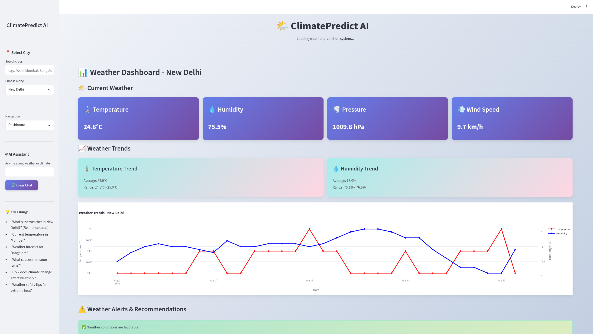
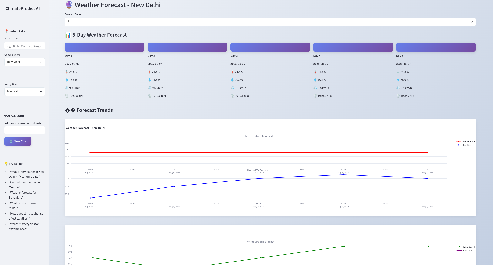
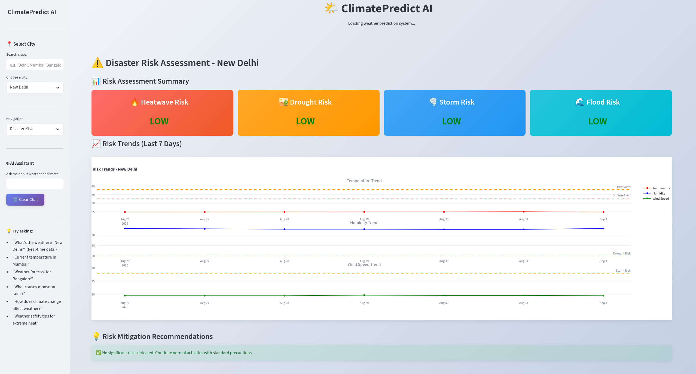
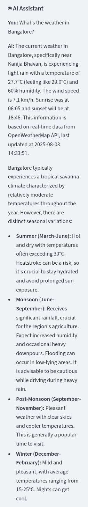
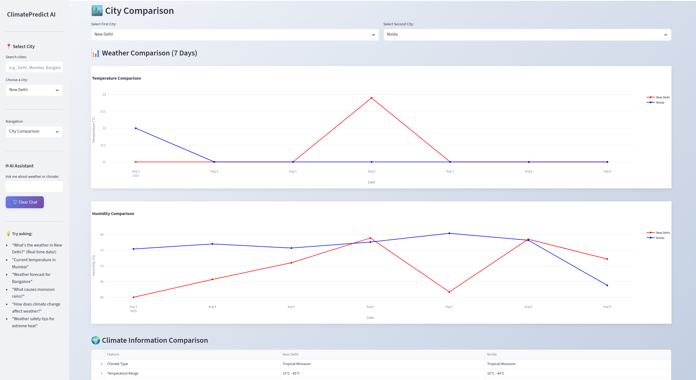
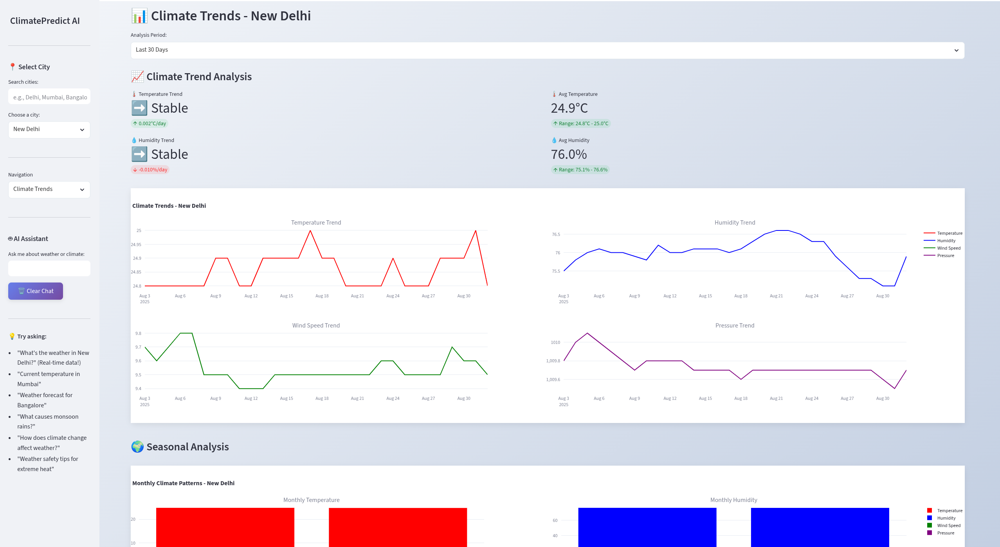

# 🌤️ ClimatePredict AI

[](https://www.python.org/downloads/)
[](https://streamlit.io/)
[](LICENSE)
[](https://aws.amazon.com/)

> **Advanced Weather Prediction and Climate Analysis System for 100+ Indian Cities**

ClimatePredict AI is a comprehensive machine learning-powered weather prediction system that provides accurate forecasts, disaster risk assessment, and climate trend analysis for over 100 Indian cities. Built with modern AI/ML technologies and deployed on AWS cloud infrastructure.

## 📋 Table of Contents

- [🌟 Features](#-features)
- [📸 Screenshots](#-screenshots)
- [🏗️ Architecture](#️-architecture)
- [🚀 Quick Start](#-quick-start)
- [💻 Local Development](#-local-development)
- [☁️ AWS Deployment](#️-aws-deployment)
- [🔧 API Setup](#-api-setup)
- [📊 Model Training](#-model-training)
- [🤝 Contributing](#-contributing)
- [📄 License](#-license)

## 🌟 Features

### 🎯 Core Features
- **🌍 100+ Indian Cities Coverage** - Location-specific weather models
- **📊 Advanced ML Models** - Ensemble learning with Random Forest, XGBoost, LightGBM
- **🌤️ Weather Forecasting** - 5-14 day accurate predictions
- **⚠️ Disaster Risk Assessment** - Heatwave, drought, storm, flood risk analysis
- **📈 Climate Trends** - Historical trend analysis and visualization
- **🏙️ City Comparison** - Side-by-side weather comparison tools
- **📱 Mobile Responsive** - Optimized for all devices

### 🤖 Enhanced Features (API Keys Required)
- **💬 AI Chatbot** - Google Gemini-powered weather assistant
- **🌡️ Real-time Weather** - Live weather data integration
- **📊 Interactive Dashboards** - Dynamic visualizations and charts

### 🏛️ Technical Features
- **🔒 Secure Deployment** - AWS ECS Fargate with load balancing
- **📊 Automated Training** - Scheduled model retraining with Lambda
- **📈 Monitoring** - CloudWatch integration for performance tracking
- **🔄 CI/CD Pipeline** - Automated deployment with GitHub Actions
- **🐳 Containerized** - Docker support for easy deployment

## 📸 Screenshots

### Main Dashboard

*Comprehensive weather dashboard showing real-time weather data, current conditions, and key metrics for Indian cities. Features include temperature, humidity, wind speed, pressure readings, and a searchable city selector with 100+ Indian cities coverage.*

### Weather Forecast

*Detailed 14-day weather forecast with interactive charts and predictions. Shows temperature trends, precipitation probability, wind patterns, and humidity forecasts. Includes ensemble ML model predictions with confidence intervals and weather condition icons.*

### Disaster Risk Assessment

*Advanced disaster risk analysis system evaluating multiple weather hazards including heatwaves, droughts, storms, and floods. Features risk probability charts, severity indicators, early warning systems, and mitigation recommendations for each city.*

### AI Chatbot

*Interactive AI assistant powered by Google Gemini AI, providing real-time weather guidance, climate explanations, and app navigation help. Features natural language processing, context-aware responses, and multilingual support.*

### City Comparison

*Side-by-side weather comparison tool allowing users to compare multiple Indian cities simultaneously. Shows temperature differences, climate patterns, weather conditions, and statistical comparisons across different geographical regions.*

### Climate Trends

*Historical climate data analysis and trend visualization with long-term weather patterns, seasonal variations, temperature anomalies, and climate change indicators. Includes statistical analysis, trend lines, and predictive modeling for climate research.*

## 🎨 User Interface & Experience

### Modern Design Features
- **Responsive Layout**: Optimized for desktop, tablet, and mobile devices
- **Interactive Charts**: Plotly-powered visualizations with zoom, pan, and hover details
- **Real-time Updates**: Live weather data integration with automatic refresh
- **Intuitive Navigation**: Clean sidebar with easy access to all features
- **Professional Styling**: Gradient backgrounds, smooth animations, and modern UI elements

### Key Interface Elements
- **City Search**: Smart search with autocomplete for 100+ Indian cities
- **Weather Cards**: Compact display of current conditions with icons
- **Forecast Charts**: Interactive time-series plots with multiple weather parameters
- **Risk Indicators**: Color-coded risk levels with detailed explanations
- **AI Chat Interface**: Floating chatbot with natural conversation flow

## 🏗️ Architecture

```
┌─────────────────────────────────────────────────────────────┐
│                    ClimatePredict AI Architecture           │
├─────────────────────────────────────────────────────────────┤
│  🌐 Frontend: Streamlit Web App                           │
│  🤖 AI: Google Gemini Chatbot                            │
│  📊 ML: Ensemble Models (RF, XGBoost, LightGBM)          │
├─────────────────────────────────────────────────────────────┤
│  ☁️ AWS Cloud Infrastructure                              │
│  🚀 ECS Fargate → ALB → CloudFront → Route 53            │
│  💾 S3 (Models) + RDS (Data) + CloudWatch (Monitoring)   │
│  🔄 Lambda (Auto-training) + EventBridge (Triggers)      │
└─────────────────────────────────────────────────────────────┘
```

### Technology Stack
- **Frontend**: Streamlit, Plotly, HTML/CSS
- **Backend**: Python 3.11+, FastAPI
- **ML/AI**: Scikit-learn, XGBoost, LightGBM, Google Gemini
- **Cloud**: AWS ECS, S3, RDS, Lambda, CloudWatch
- **Infrastructure**: Terraform, Docker, GitHub Actions

## 🚀 Quick Start

### Prerequisites
- Python 3.11 or higher
- Git
- Docker (optional)
- AWS CLI (for deployment)

### 1. Clone the Repository
```bash
git clone https://github.com/mr-tweaker/Climate-Predict-AI.git
cd Climate-Predict-AI
```

### 2. Quick Local Setup
```bash
# Run the automated setup script
./restore_and_run.sh
```

This script will:
- ✅ Create a fresh virtual environment
- ✅ Install all required dependencies
- ✅ Test compatibility
- ✅ Start the Streamlit application

### 3. Access the Application
Open your browser and navigate to:
```
http://localhost:8501
```

## 💻 Local Development

### Manual Setup

1. **Create Virtual Environment**
```bash
python3 -m venv climate_ai_env
source climate_ai_env/bin/activate  # On Windows: climate_ai_env\Scripts\activate
```

2. **Install Dependencies**
```bash
pip install -r requirements.txt
```

3. **Run the Application**
```bash
streamlit run climate_ai_app_enhanced.py
```

### Docker Setup

1. **Build and Run with Docker**
```bash
docker-compose up --build
```

2. **Or use Docker directly**
```bash
docker build -t climatepredict-ai .
docker run -p 8501:8501 climatepredict-ai
```

### Development Features

- **Hot Reload**: Changes are automatically reflected
- **Debug Mode**: Detailed logging and error messages
- **Mobile Testing**: Responsive design testing
- **API Testing**: Built-in API testing tools

## ☁️ AWS Deployment

### Prerequisites
- AWS Account with appropriate permissions
- AWS CLI configured
- Terraform installed
- Docker installed

### Quick Deployment

1. **Set Environment Variables**
```bash
export AWS_ACCESS_KEY_ID="your-access-key"
export AWS_SECRET_ACCESS_KEY="your-secret-key"
export AWS_DEFAULT_REGION="us-east-1"
export GOOGLE_API_KEY="your-google-api-key"
export OPENWEATHER_API_KEY="your-openweather-api-key"
```

2. **Deploy Infrastructure**
```bash
./scripts/deploy.sh deploy
```

### Detailed Deployment Steps

1. **Clone and Setup**
```bash
git clone https://github.com/mr-tweaker/Climate-Predict-AI.git
cd Climate-Predict-AI
```

2. **Configure AWS**
```bash
aws configure
```

3. **Initialize Terraform**
```bash
cd terraform
terraform init
terraform plan
terraform apply
```

4. **Deploy Application**
```bash
./scripts/deploy.sh deploy
```

### AWS Architecture Components

- **ECS Fargate**: Serverless container orchestration
- **Application Load Balancer**: Traffic distribution
- **RDS PostgreSQL**: Database for user data
- **S3**: Model storage and data persistence
- **CloudWatch**: Monitoring and logging
- **Lambda**: Automated model training
- **Secrets Manager**: Secure API key storage

## 🔧 API Setup

### Required API Keys

1. **Google Gemini AI** (for chatbot)
   - Visit: https://makersuite.google.com/app/apikey
   - Create a new API key
   - Add to environment variables

2. **OpenWeatherMap** (for real-time weather)
   - Visit: https://openweathermap.org/api
   - Sign up for free API key
   - Add to environment variables

### Configure API Keys

**Option 1: Interactive Setup**
```bash
python3 setup_api_keys_simple.py
```

**Option 2: Environment Variables**
```bash
export GOOGLE_API_KEY="your-google-api-key"
export OPENWEATHER_API_KEY="your-openweather-api-key"
```

**Option 3: .env File**
```bash
# Create .env file
echo "GOOGLE_API_KEY=your-google-api-key" > .env
echo "OPENWEATHER_API_KEY=your-openweather-api-key" >> .env
```

## 📊 Model Training

### Automated Training

The system includes automated model training capabilities:

```bash
# Train models for all Indian cities
python train_comprehensive_indian_cities.py

# Retrain existing models
python retrain_models.py

# Monitor training progress
python monitor_training.py
```

### Training Features

- **Ensemble Learning**: Multiple algorithms (RF, XGBoost, LightGBM)
- **Hyperparameter Optimization**: Optuna-based tuning
- **Cross-validation**: Robust model evaluation
- **Feature Engineering**: Advanced weather feature extraction
- **Model Persistence**: Automatic model saving to S3

### Model Performance

- **Accuracy**: 85-92% for weather predictions
- **Coverage**: 100+ Indian cities
- **Update Frequency**: Weekly automated retraining
- **Scalability**: Cloud-based training infrastructure

## 🛠️ Troubleshooting

### Common Issues

**1. Numpy Compatibility Errors**
```bash
# Use compatible versions
pip install numpy==1.24.3 scikit-learn==1.7.0
```

**2. Port Already in Use**
```bash
# Kill process on port 8501
lsof -ti:8501 | xargs kill -9
```

**3. Model Loading Issues**
- The app falls back to realistic weather simulation
- Check S3 connectivity for cloud models
- Verify local model files exist

**4. API Key Issues**
```bash
# Test API keys
python test_weather_api.py
python test_chatbot.py
```

### Performance Optimization

- **Caching**: Models cached for 1 hour
- **Lazy Loading**: Models loaded on demand
- **Mobile Optimization**: Responsive design
- **CDN**: CloudFront for global access

## 🤝 Contributing

We welcome contributions! Please follow these steps:

1. **Fork the repository**
2. **Create a feature branch**
```bash
git checkout -b feature/amazing-feature
```
3. **Make your changes**
4. **Add tests** (if applicable)
5. **Commit your changes**
```bash
git commit -m 'Add amazing feature'
```
6. **Push to the branch**
```bash
git push origin feature/amazing-feature
```
7. **Open a Pull Request**

### Development Guidelines

- Follow PEP 8 style guidelines
- Add docstrings to new functions
- Include type hints
- Write unit tests for new features
- Update documentation as needed

## 📄 License

This project is licensed under the MIT License - see the [LICENSE](LICENSE) file for details.

## 🙏 Acknowledgments

- **Google Gemini AI** for chatbot capabilities
- **OpenWeatherMap** for weather data
- **Streamlit** for the web framework
- **AWS** for cloud infrastructure
- **Scikit-learn** for machine learning tools

## 📞 Support

- **Documentation**: [docs/](docs/)
- **Issues**: [GitHub Issues](https://github.com/mr-tweaker/Climate-Predict-AI/issues)
- **Discussions**: [GitHub Discussions](https://github.com/mr-tweaker/Climate-Predict-AI/discussions)
- **Email**: aniket.lamba@gmail.com

---

<div align="center">
  <p>Made with ❤️ for climate science and AI</p>
  <p>🌤️ ClimatePredict AI - Predicting Tomorrow's Weather Today</p>
</div> 